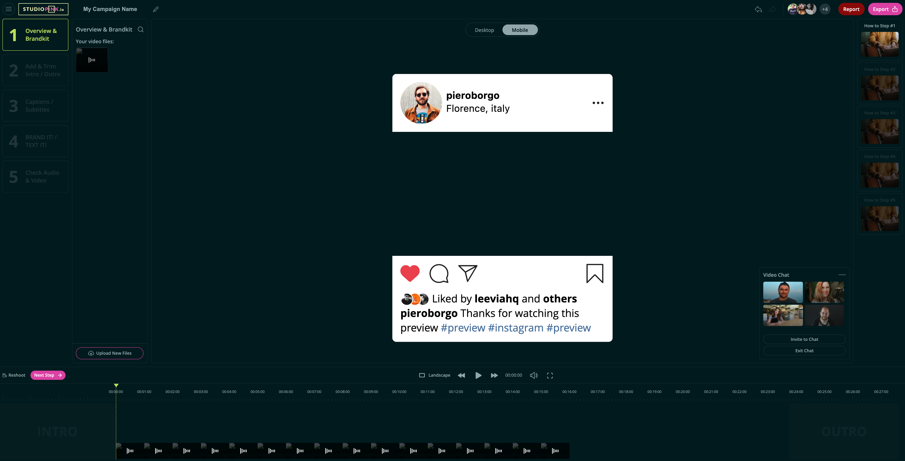

# Pink Editor

The Pink Editor has been built on top of [Shotstack](https://shotstack.io).



## Description

The Pink Editor is a Vue.js video editing application that provides the following capabilities:

- Timeline editing
- Drag and Drop interface for titles
- Custom fonts and styling of titles
- Manuall add subtitles or import SRT file
- Adding intros and outros to video
- Add audio, soundtracks
- Record and add audio to video via microphone
- Trimming and merging of videos
- Export as MP4, GIF or MP3
- Export aspect ratios
- Export in SD, HD (720p) and full HD (1080p)
- Edit videos in different aspect ratio's (16:9, Instagram Story, TikTok, Square)
- Add transitions between clips
- Add effects and filters to titles and clips

## Summary

The application consists out of two components. The front-end editor and the backend server.

### Editor

The editor component provides the front-end interface to edit videos. The frontend communicates
with the server using `socket.io`.

### Server

The server component provides the backend functionality to store media assets, subtitles and send
completed edits to Shot

## Requirements

`Node.js v12.13.0+`

## Installation

Install Node dependencies.

```bash
npm --prefix ./editor install
npm --prefix ./server install
```

## Configuration

The below instructions will allow you to set up the editor locally. This will allow you to use the
front-end interface and create video edits. To render your videos the application needs to be set
up where the media assets and font files are publicly accessible - for Shotstack to download the
assets for rendering.

### Editor

The editor requires you to set environment variables for `VUE_APP_SOCKET_API` of the `socket.io` connection
and the `VUE_APP_API` for the API endpoints exposed on the server. The `BASE_URL` is used for routing.

Run the following commands to create a `.env` file in your editor directory:

```bash
cd server
touch .env
```

Add the following to your new `.env` file:

```bash
VUE_APP_SOCKET_API=ws://localhost:3000
VUE_APP_API=https://localhost:3000
BASE_URL=https://localhost:3000
```

Add the above to your .env file in the /editor directory.

### Server

The server requires you to set up environment variables for the `PORT` and `DOMAIN` for the server to run on.

Run the following commands to create a `.env` file in your server directory:

```bash
cd server
touch .env
```

The `SHOTSTACK_API` is the base url for the [Shotstack video editing API](https://shotstack.io) that renders
the videos. You can [register](https://dashboard.shotstack.io/register) on the Shotstack website for a free `SHOTSTACK_API_KEY`.

To enable a secure connection between the Editor and the Server you need to reference the SSL keypair you want
to use to encrypt the connection. For development purposes you can use a self-signed certificate using an utility
such as [mkcert](https://github.com/FiloSottile/mkcert). For production you can use [Let's Encrypt](https://letsencrypt.org/).

Based on the above add the following to your new `.env` file:

```bash
PORT=3000
DOMAIN=https://localhost:3000
SHOTSTACK_API=https://api.shotstack.io/edit/v1
SHOTSTACK_API_KEY=SHOTSTACK_API_KEY
SSL_privkey=key.pem
SSL_fullchain=cert.pem
```

Add the above to your .env file in the /server directory.

## Run locally

To run the editor locally run the following commands and go to [https://localhost:3000](https://localhost:3000).

### Editor

The following command builds the editor, moves it to the server directory and watches for changes:

```bash
cd editor
npm run xxx
```

### Server

The following command starts the server and watches for changes:

```bash
cd server
npm run dev
```
